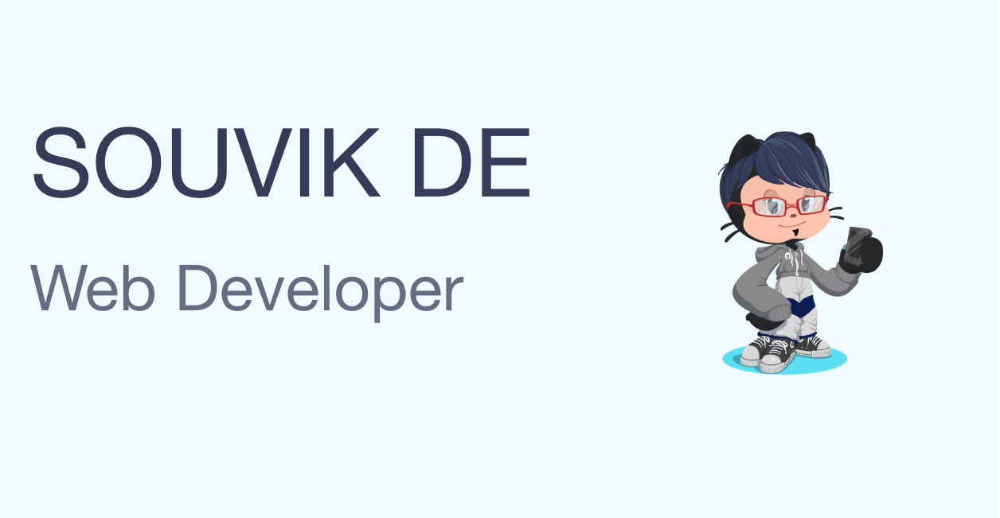

## Hi, I'm Souvik 👋 🧑🏻‍💻

I am a CSE undergrad, pursuing my passion in computer science. Recently I am facinated by **react**,**nodejs** and other web technologies. I am monstly self taught, and love working on opensource projects.

 

---

 

## 🔭 I’m currently working on

## The language I love

